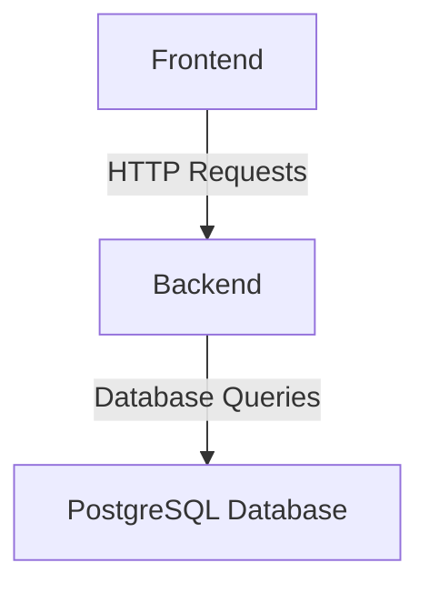

# PERN Todo Application

#### This is a simple Todo application built using the PERN (PostgreSQL, Express, React, Node.js) stack. The application allows users to create, read, update, and delete todos.



The frontend communicates with the backend through HTTP requests, and the backend interacts with the PostgreSQL database by executing database queries.

## Backend Setup

- Clone the repository and navigate to the backend directory.
- Install the required dependencies by running the following command:

```bash
npm install

```

- Create a PostgreSQL database named todoapp.
- Create the todo table in the database by executing the following SQL query:

```sql
CREATE TABLE todo (
  id SERIAL PRIMARY KEY,
  title VARCHAR(255),
  description VARCHAR(255),
  status VARCHAR(255)
);

```

- Update the db.js file located in the backend directory with your PostgreSQL connection details.

```javascript
import Pool from "pg-pool";

const pool = new Pool({
  user: "your_postgres_user",
  host: "localhost",
  database: "todoapp",
  port: 5432,
});

export default pool;
```

- Start the backend server by running the following command:

```bash
npm start

```

- The server will run on port 8000.

## Frontend Setup

- Navigate to the frontend directory.
- Install the required dependencies by running the following command:

```bash
npm install

```

- Update the API URL in the following files:
  - InputTodo.js
  - ListToDos.js
  - EditTodo.js

Replace http://localhost:8000 with the URL where your backend server is running.

- Start the frontend development server by running the following command:

```bash
npm start

```

The frontend application will be accessible at http://localhost:3000.

## Usage

- Open the Todo application in your web browser.
- The main page will display a list of existing todos.
- To create a new todo, enter a title, description, and status in the input fields and click the "Create A Todo" button.
- To edit a todo, click the "Edit" button next to the todo and update the fields in the modal. Click the "Update" button to save the changes.
- To delete a todo, click the "delete" button next to the todo.

## Project Structure

.
├── backend # Backend server directory
│ ├── db.js # Database connection configuration
│ └── index.js # Express server setup and routes
└── frontend # Frontend React application directory
├── src
│ ├── components # Reusable components
│ ├── pages # Application pages
│ ├── App.js # Main application component
│ └── index.js # Entry point
├── public # Public assets
└── package.json # Frontend dependencies and scripts

## License

This project is licensed under the MIT License. See the LICENSE file for details.
